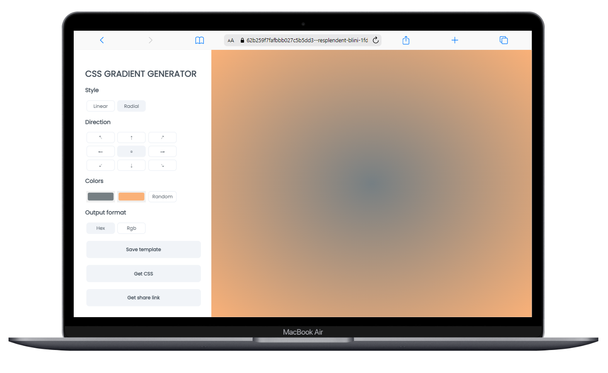
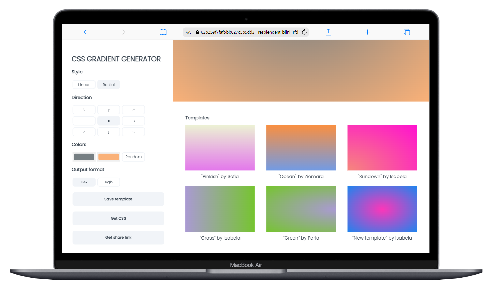

# CSS Gradient Generator

## Project description

This project is a responsive CSS gradient generator made with React, that allows the user to choose style (linear or radial), direction, and two colors (or random choice), and renders the created gradient. Users can get the CSS code in the chosen output format (hex or rgb), and a share link of the template. They can also save templates, identified by the name and who created it; this saved templates are public for everyone to see or use. 

## Tech stack

[mockAPI](https://mockapi.io/projects) was used to save the "saved templates" data.

## Deployed project

Link to the deployed project: https://62b259f7fafbbb027c5b5dd3--resplendent-blini-1fd4c8.netlify.app/

## Author

| Developer | Contact | 
| Ma. Isabela Huitrón |   |